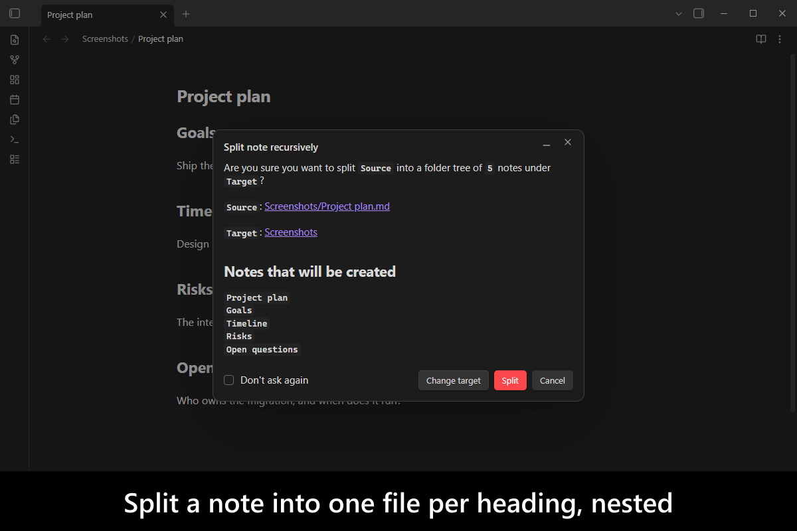
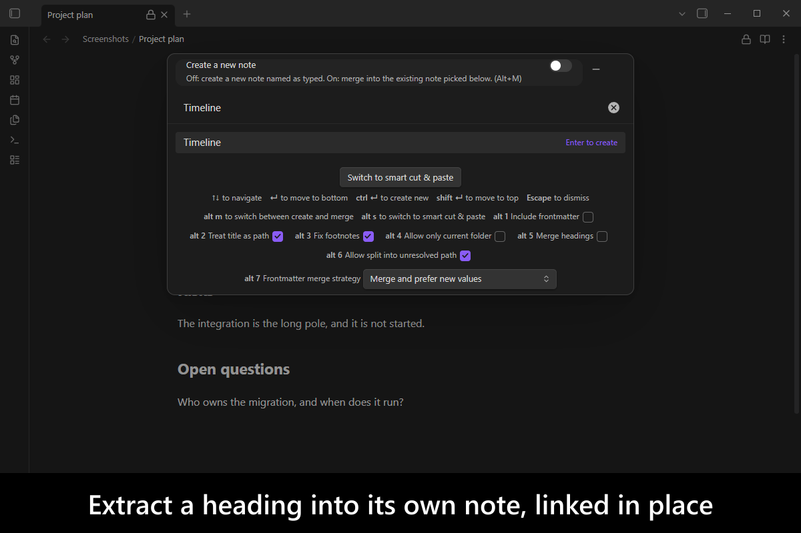
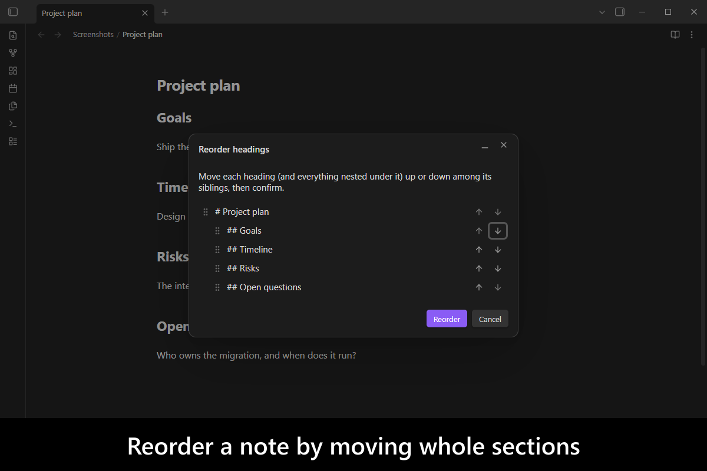
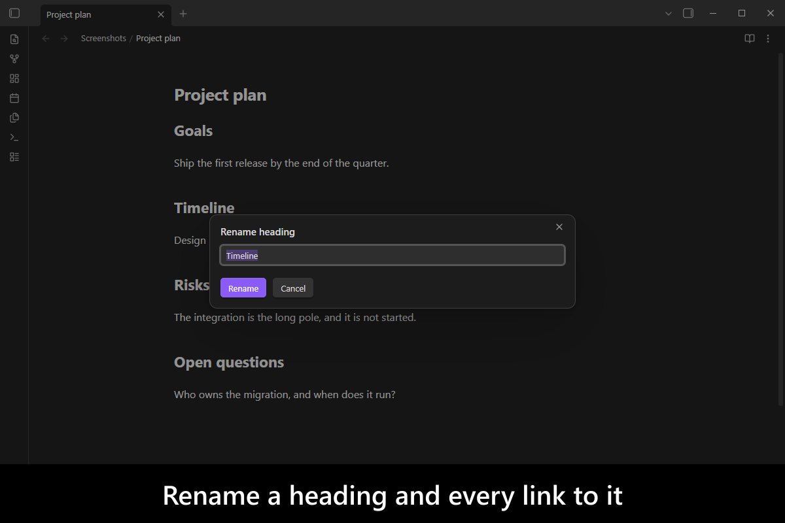
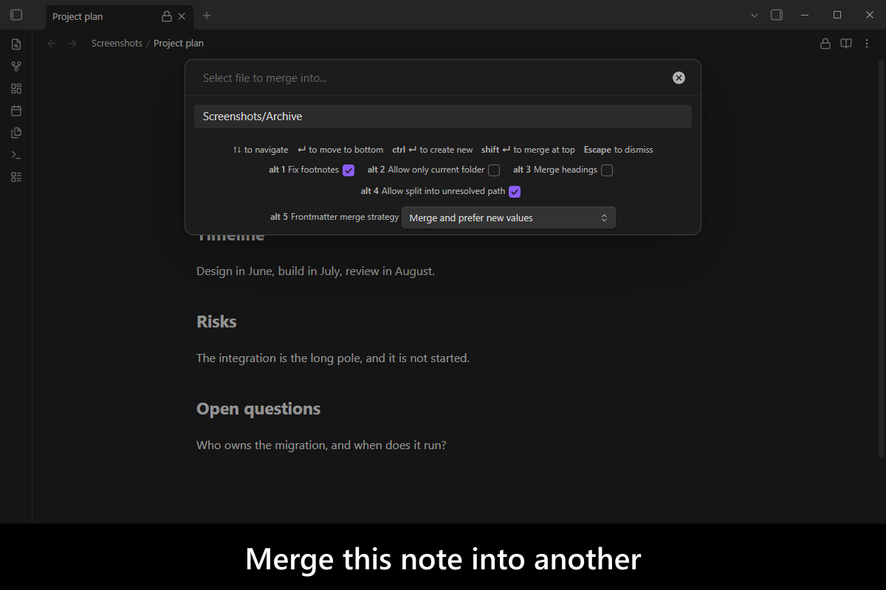
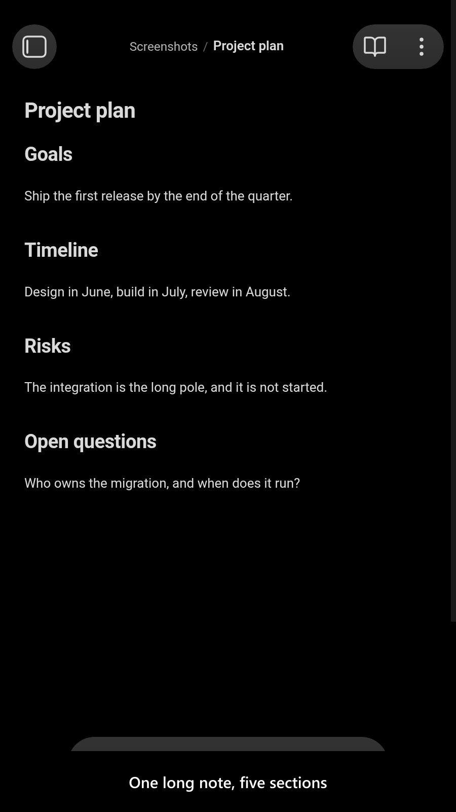
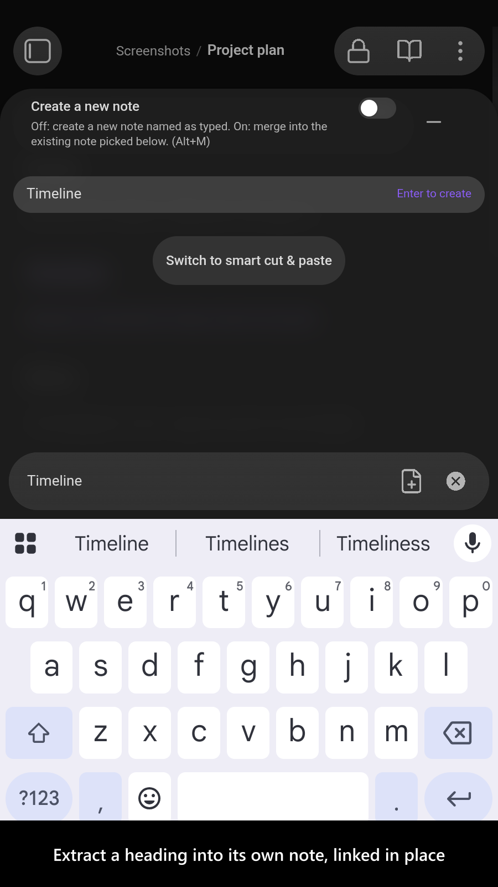
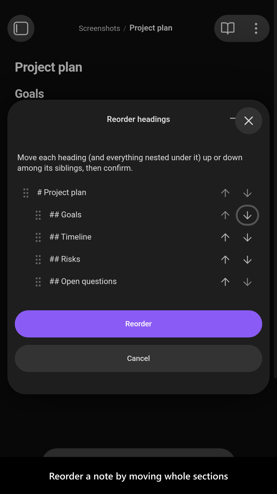
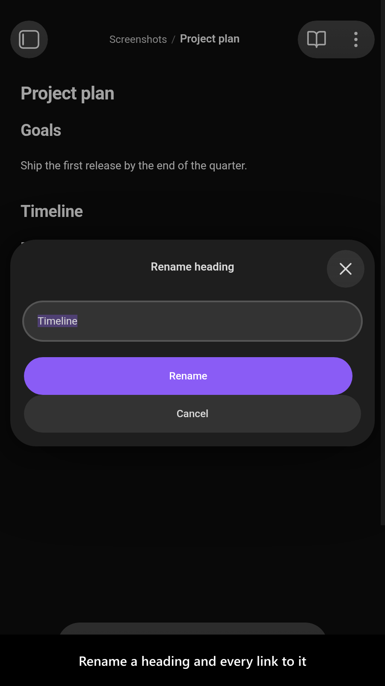
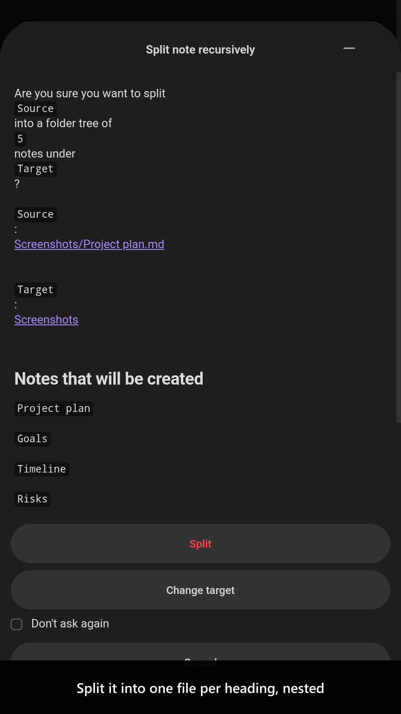

# Advanced Note Composer

[](https://www.buymeacoffee.com/mnaoumov)
[](https://github.com/mnaoumov/obsidian-advanced-note-composer/releases)
[](https://github.com/mnaoumov/obsidian-advanced-note-composer/releases)
[](https://github.com/mnaoumov/obsidian-advanced-note-composer)

Obsidian's core [`Note composer`](https://help.obsidian.md/plugins/note-composer) moves text between
notes, but it moves it bluntly: relative links come out pointing at nothing, a heading whose title
contains a character a file name cannot hold is refused outright, and extracted text is always
appended to the target — you never get to say where it lands. This
[Obsidian](https://obsidian.md/) plugin fixes those, and then goes considerably further: whole
folders can be merged, split, flattened, reordered and renamed; a note's heading hierarchy can become
a folder tree; and a selection can be marked in one note and dropped at an exact cursor position in
another.

<!-- markdownlint-disable MD033 -->

<a href="images/screenshots/screenshot-desktop-1.png"></a>

<details>
<summary>More screenshots</summary>

<a href="images/screenshots/screenshot-desktop-2.png"></a>
<a href="images/screenshots/screenshot-desktop-3.png"></a>
<a href="images/screenshots/screenshot-desktop-4.png"></a>
<a href="images/screenshots/screenshot-desktop-5.png"></a>
<a href="images/screenshots/screenshot-mobile-1.png"></a>
<a href="images/screenshots/screenshot-mobile-2.png"></a>
<a href="images/screenshots/screenshot-mobile-3.png"></a>
<a href="images/screenshots/screenshot-mobile-4.png"></a>
<a href="images/screenshots/screenshot-mobile-5.png"></a>

</details>

<!-- markdownlint-enable MD033 -->

## Demo vault

**The documentation is an interactive demo vault.** Every feature has a note that explains what it
does and why you would want it, and walks you through it step by step — most of them with a button
that sets the relevant setting for you so you can try it immediately.

**[Start reading here](<./demo-vault/00 Start.md>)** — it is plain markdown, so it works on GitHub
with nothing installed.

A copy of the vault ships with every release. You can access it via any of the following:

1. Running the **Advanced Note Composer: Open demo vault** command.
2. Downloading `advanced-note-composer-demo-vault-<version>.zip` (`<version>` is the release version)
   from the [Releases](https://github.com/mnaoumov/obsidian-advanced-note-composer/releases).
3. Browsing its source in [`demo-vault/`](./demo-vault/README.md) in this repository.

## What it does

- **Merge** — a note into another, a folder into a folder, several selected notes at once, or a whole
  folder tree down into one file, with frontmatter reconciled by a strategy you choose and
  attachments carried along.
  [Merge file](<./demo-vault/01 Merge/01 Merge file.md>) ·
  [Merge folder](<./demo-vault/01 Merge/02 Merge folder.md>) ·
  [Merge folder into single file](<./demo-vault/01 Merge/03 Merge folder into single file.md>) ·
  [Merge multiple files](<./demo-vault/01 Merge/04 Merge multiple files.md>) ·
  [Frontmatter merge strategy](<./demo-vault/09 Titles, links and frontmatter/30 Frontmatter merge strategy.md>)
- **Extract** — a selection, a heading and everything under it, the block between two horizontal
  rules, or everything before or after the cursor — leaving a link, an embed, or nothing behind. With
  nothing selected it creates an empty note and leaves the link at the cursor, so a note you have not
  written yet can exist without your cursor going anywhere; the file explorer's folder menu creates one
  the same way.
  [Extract selection](<./demo-vault/02 Extract/05 Extract selection.md>) ·
  [Extract heading](<./demo-vault/02 Extract/06 Extract heading.md>) ·
  [Extract between horizontal rules](<./demo-vault/02 Extract/08 Extract between horizontal rules.md>) ·
  [Text after extraction](<./demo-vault/02 Extract/07 Text after extraction.md>) ·
  [Create empty note](<./demo-vault/02 Extract/37 Create empty note.md>)
- **Split** — by heading level, or recursively, turning a whole note's heading hierarchy (or one
  section of it) into a folder tree. The picker says up front whether you are creating a note or
  merging into an existing one.
  [Split by headings](<./demo-vault/03 Split/09 Split by headings.md>) ·
  [Split into folder](<./demo-vault/03 Split/11 Split into folder.md>) ·
  [Split headings recursively](<./demo-vault/03 Split/13 Split headings recursively.md>) ·
  [Create or merge when splitting](<./demo-vault/03 Split/10 Create or merge when splitting.md>)
- **Swap** — two files, two folders, or two selections trade places in one reversible operation.
  [Swap file](<./demo-vault/05 Swap/17 Swap file.md>) ·
  [Swap folder](<./demo-vault/05 Swap/18 Swap folder.md>) ·
  [Swap selections](<./demo-vault/05 Swap/19 Swap selections.md>)
- **Folder operations** — flatten a folder into its parent, move one somewhere else, create a folder
  and its notes from a template, reorder folders and renumber them, or rename one and keep its folder
  note in step.
  [Flatten folder](<./demo-vault/06 Folder operations/20 Flatten folder.md>) ·
  [Move folder to](<./demo-vault/06 Folder operations/21 Move folder to.md>) ·
  [Create folder with notes](<./demo-vault/06 Folder operations/22 Create folder with notes.md>) ·
  [Reorder folders](<./demo-vault/06 Folder operations/23 Reorder folders.md>) ·
  [Rename folder](<./demo-vault/06 Folder operations/24 Rename folder.md>)
- **Smart cut & paste** — mark a selection or a whole heading, then drop it at an exact cursor
  position in any note, including the one you took it from.
  [Smart cut and paste](<./demo-vault/07 Smart cut and paste/25 Smart cut and paste.md>)
- **Titles, links and frontmatter** — relative links are rewritten so they keep resolving, invalid
  title characters are cleaned up (or mapped by a template of your own) instead of refused, a title
  containing `/` can become a real path, and merged or split content can be wrapped in a template.
  [Relative links](<./demo-vault/09 Titles, links and frontmatter/27 Relative links.md>) ·
  [Invalid titles](<./demo-vault/09 Titles, links and frontmatter/28 Invalid titles.md>) ·
  [Treat title as path](<./demo-vault/09 Titles, links and frontmatter/29 Treat title as path.md>) ·
  [Templates](<./demo-vault/09 Titles, links and frontmatter/31 Templates.md>)
- **Headings** — reorder a note's sections, or rename a heading and have its backlinks follow.
  [Reorder headings](<./demo-vault/04 Headings/15 Reorder headings.md>) ·
  [Rename heading](<./demo-vault/04 Headings/16 Rename heading.md>)
- **Include / exclude paths** — two independent filters: what the plugin may touch, and where its
  commands are offered at all.
  [Block commands on excluded paths](<./demo-vault/08 Include and exclude/26 Block commands on excluded paths.md>)
- **UI** — every dialog can be minimized, and every one of them can be pointed at a different target
  without cancelling the operation;
  operations report what they are doing; and the settings tab is a short list of pages rather than one
  long scroll.
  [Minimizing dialogs](<./demo-vault/10 UI/32 Minimizing dialogs.md>) ·
  [Operation notices](<./demo-vault/10 UI/33 Operation notices.md>) ·
  [Change target](<./demo-vault/10 UI/34 Change target.md>) ·
  [Finding a setting](<./demo-vault/10 UI/35 Finding a setting.md>)

## Installation

The plugin is available in [the official Community Plugins repository](https://obsidian.md/plugins?id=advanced-note-composer).

### Beta versions

To install the latest beta release of this plugin (regardless if it is available in [the official Community Plugins repository](https://obsidian.md/plugins) or not), follow these steps:

1. Ensure you have the [BRAT plugin](https://obsidian.md/plugins?id=obsidian42-brat) installed and enabled.
2. Click [Install via BRAT](https://intradeus.github.io/http-protocol-redirector?r=obsidian://brat?plugin=https://github.com/mnaoumov/obsidian-advanced-note-composer).
3. An Obsidian pop-up window should appear. In the window, click the `Add plugin` button once and wait a few seconds for the plugin to install.

## Debugging

By default, debug messages for this plugin are hidden.

To show them, run the following command:

```js
window.DEBUG.enable('advanced-note-composer');
```

For more details, refer to the [documentation](https://mnaoumov.dev/obsidian-dev-utils/guides/debugging/).

## Changelog

All notable changes to this project will be documented in the [CHANGELOG](./CHANGELOG.md).

## Contributing

Contributions are welcome — see [CONTRIBUTING](./CONTRIBUTING.md) to get set up.

## Support

<!-- markdownlint-disable MD033 -->

<a href="https://www.buymeacoffee.com/mnaoumov" target="_blank"></a>

<!-- markdownlint-enable MD033 -->

## My other Obsidian resources

[See my other Obsidian resources](https://github.com/mnaoumov/obsidian-resources).

## License

© [Michael Naumov](https://github.com/mnaoumov/)
